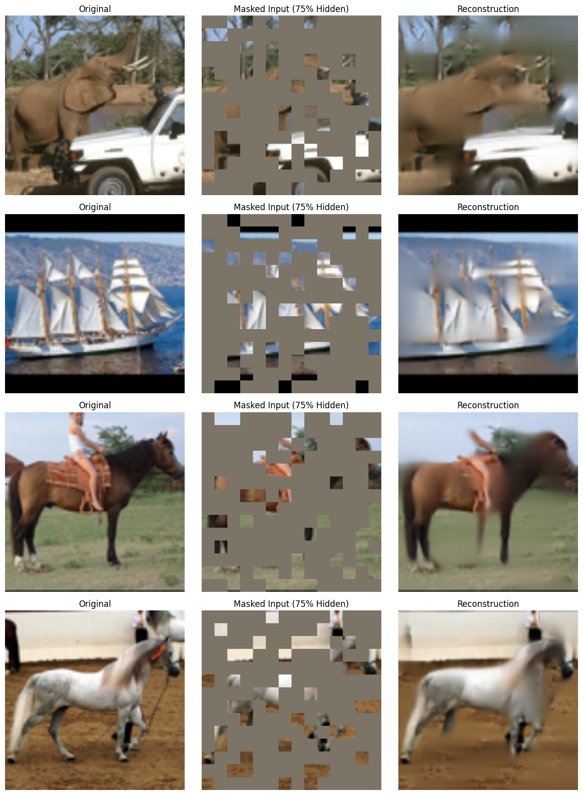
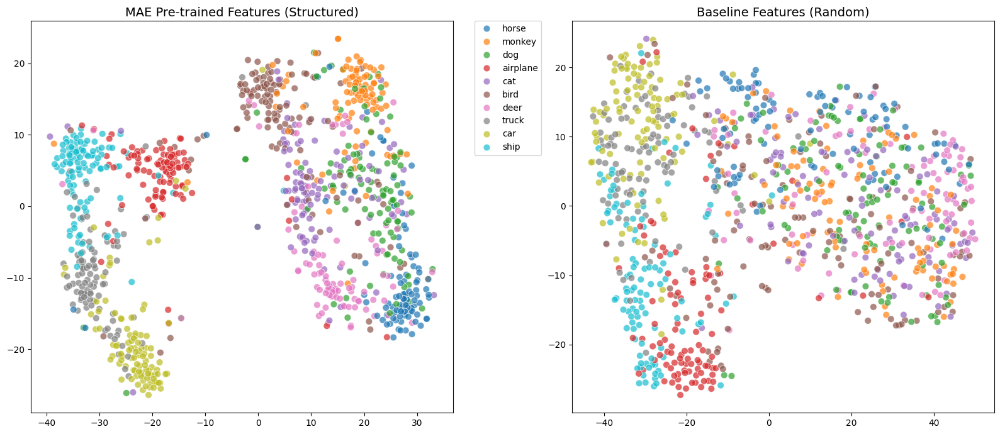
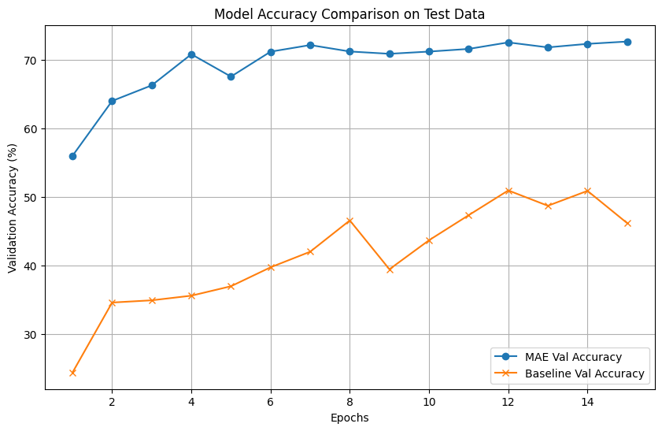
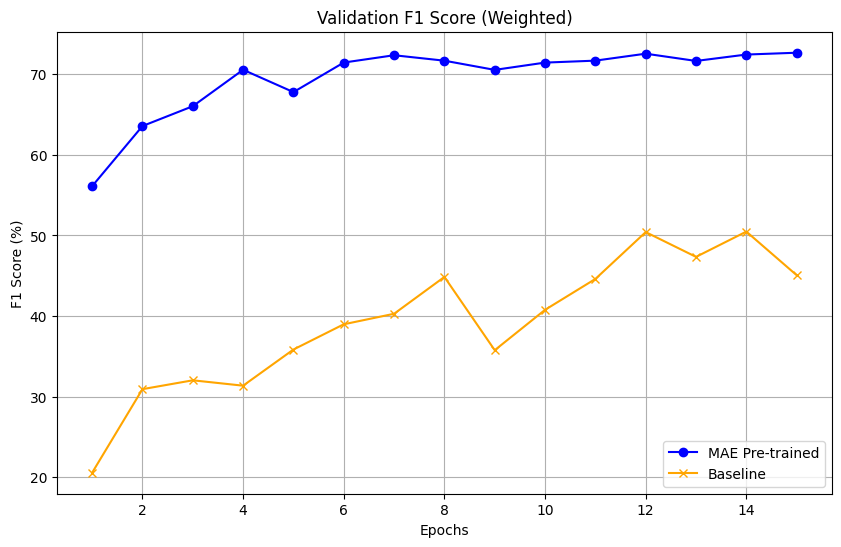
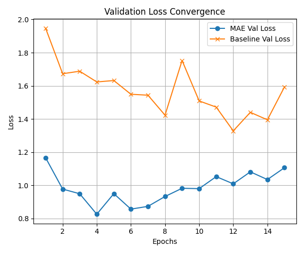

# Self-Supervised Representation Learning with Masked Autoencoders (MAE)


A PyTorch implementation of **Masked Autoencoders (MAE)** (He et al., 2022) applied to the **STL-10** dataset. This project demonstrates how self-supervised learning can leverage large-scale **unlabeled data (100k images)** to learn robust visual representations, significantly outperforming supervised training from scratch when labeled data is limited.

---

## 🌟 Key Features

- **Asymmetric Autoencoder:** Vision Transformer (ViT-Base) encoder with a lightweight decoder.
- **75% Masking Ratio:** Encourages global context understanding instead of local pixel interpolation.
- **Robust Loss Function:** Uses **L1 Loss** for sharper reconstructions compared to MSE.
- **Data Efficient:** Pre-trained encoder converges **4× faster** (≈5 epochs vs 20) on downstream tasks.
- **Latent Space Analysis:** Includes **t-SNE** visualization of learned feature manifolds.

---

## 🎨 Visual Reconstruction Results

The core idea of MAE is to mask a large portion of the image and reconstruct the missing pixels.

**Top:** Original Image  
**Middle:** Masked Input (model input)  
**Bottom:** Reconstruction (model output)



*Figure 1: Reconstruction results after 50 epochs of self-supervised pre-training using L1 Loss. The model successfully hallucinates missing structures such as object bodies and geometric components.*

---

## 📊 Experimental Results

### 1. Latent Space Visualization (t-SNE)

Does the model learn semantic structure without labels?



*Figure 2: **MAE pre-trained model (left)** forms dense, semantically meaningful clusters before fine-tuning. The **baseline model (right)** trained from scratch exhibits a scattered and brittle feature space.*

---

### 2. Fine-Tuning Performance

The pre-trained encoder is fine-tuned on a **5k labeled subset** of STL-10 and compared with a ViT trained from scratch.

| Validation Accuracy | Validation F1-Score |
|:---:|:---:|
|  |  |
| *Figure 3a: MAE pre-training (blue) significantly outperforms baseline (orange).* | *Figure 3b: F1-score confirms robustness across all classes.* |

---

### 3. Convergence Speed



*Figure 4: The MAE pre-trained model reaches optimal performance in ~5 epochs, while the baseline requires substantially more compute to reach lower final accuracy.*

---

## 🚀 Installation

1. **Clone the repository**

```bash
git clone https://github.com/yourusername/mae-stl10.git
cd mae-stl10
```

2. **Install dependencies**

```bash
pip install -r requirements.txt
```

---

## 💻 Usage

### Step 1: Self-Supervised Pre-Training

Train the Masked Autoencoder on the **100k unlabeled images** of STL-10.

```bash
jupyter notebook Self_Supervised_Learning.ipynb
```

- **Input:** STL-10 Unlabeled Split  
- **Output:** Encoder weights saved as `mae_encoder_final.pth`

---

### Step 2: Fine-Tuning & Evaluation

Fine-tune the pre-trained encoder on the **5k labeled images** and evaluate performance.

```bash
jupyter notebook Fine_Tuning.ipynb
```

- **Input:** STL-10 Train/Test Split + `mae_encoder_final.pth`  
- **Output:** Classification metrics, confusion matrix, and comparison plots

---

## 📂 Project Structure

```text
.
├── models.py                      # MAE model (ViT encoder + lightweight decoder)
├── Self_Supervised_Learning.ipynb # Pre-training & reconstruction visualization
├── Fine_Tuning.ipynb              # Downstream classification & evaluation
├── requirements.txt               # Python dependencies
├── images/                        # Saved plots and figures
│   ├── comparison_accuracy.png
│   ├── comparison_f1.png
│   ├── comparison_loss.png
│   ├── Epoch_50_ssl_L1.png
│   └── tsne_features.png
└── README.md                      # Project documentation
```

---

## 📜 References

This project is based on the following work:

**Masked Autoencoders Are Scalable Vision Learners**  
Kaiming He, Xinlei Chen, Saining Xie, Yanghao Li, Piotr Dollár, Ross Girshick  
*CVPR 2022*  
arXiv: **2111.06377**

